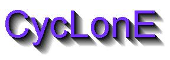



## Real 3D Text

### Description

A ver simple yet interesting Real 3D text. I noticed a programmer who posted a 3d text sample but was somehow a poor sample. This one took me only 2 minutes to make. enjoy !!!
 
### More Info
 

             |
---                |---
**Submitted On**   |2003-01-13 19:50:02
**By**             |[M H](https://github.com/Planet-Source-Code/PSCIndex/blob/master/ByAuthor/m-h.md)
**Level**          |Beginner
**User Rating**    |4.8 (19 globes from 4 users)
**Compatibility**  |VB 3\.0, VB 4\.0 \(16\-bit\), VB 4\.0 \(32\-bit\), VB 5\.0, VB 6\.0
**Category**       |[Coding Standards](https://github.com/Planet-Source-Code/PSCIndex/blob/master/ByCategory/coding-standards__1-43.md)
**World**          |[Visual Basic](https://github.com/Planet-Source-Code/PSCIndex/blob/master/ByWorld/visual-basic.md)
**Archive File**   |[Real\_3D\_Te1528721132003\.zip](https://github.com/Planet-Source-Code/m-h-real-3d-text__1-42401/archive/master.zip)

